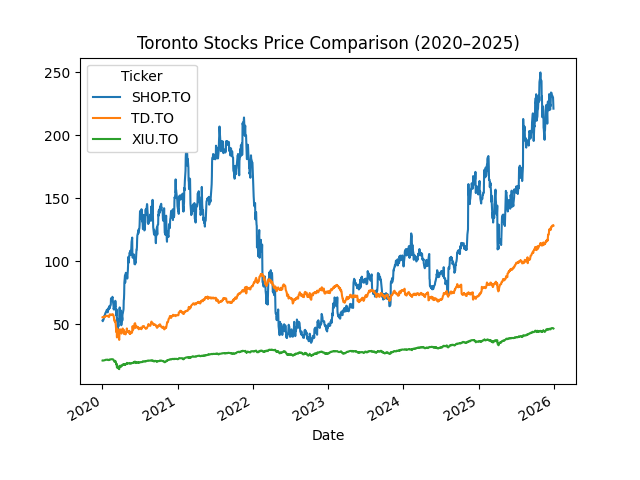
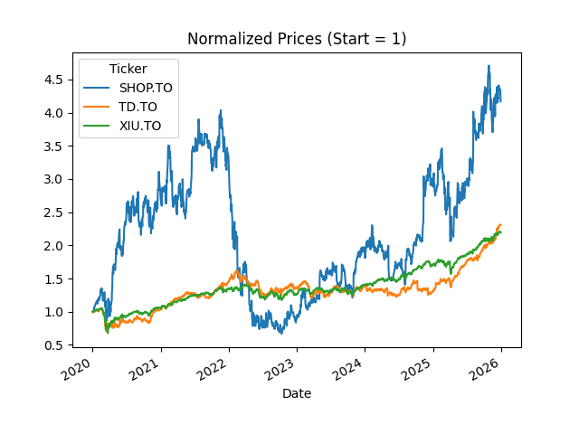
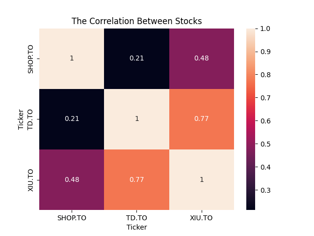
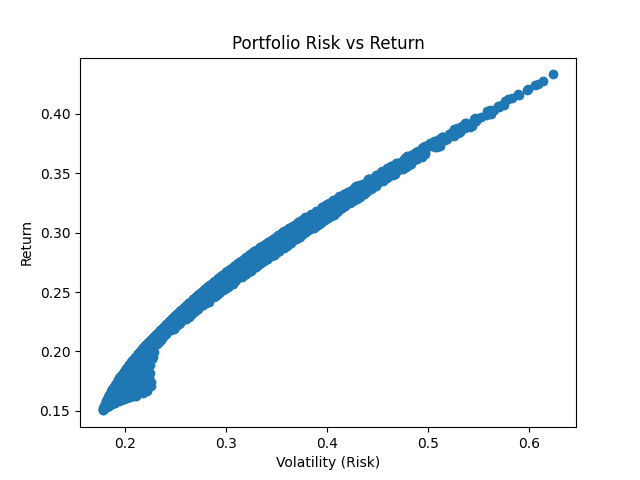
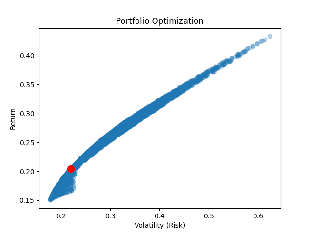

# Toronto Stock Market Analysis 📊

## Overview

This project analyzes historical stock data from major Toronto-listed assets to evaluate performance, volatility, and diversification. The goal is to understand how different types of assets behave over time and how they can be combined to form a balanced investment portfolio.

The analysis focuses on three representative securities:

* **XIU.TO** – TSX Composite Index ETF (broad market exposure)
* **TD.TO** – Toronto-Dominion Bank (stable blue-chip stock)
* **SHOP.TO** – Shopify (high-growth, high-volatility tech stock)

---

## Objectives

* Compare long-term price performance (2020–2025)
* Evaluate relative growth using normalized prices
* Measure daily returns and volatility
* Analyze correlations between assets
* Explore diversification and risk-return trade-offs

---

## Data Collection

Stock data was collected using the `yfinance` Python library, covering the period from January 2020 to January 2026. The dataset includes daily closing prices for each asset.

---

## Methodology

### 1. Price Trend Analysis

Raw closing prices were plotted over time to observe overall performance trends and relative growth between assets.

### 2. Normalization

Prices were normalized to start at 1:
This allows for direct comparison of growth rates regardless of initial price differences.

### 3. Returns Calculation

Daily returns were computed using percentage change:
This provides insight into short-term fluctuations and volatility.

### 4. Correlation Analysis

A correlation matrix was computed and visualized using a heatmap to evaluate relationships between asset returns.

### 5. Risk vs Return Analysis

Mean returns and standard deviations were compared to evaluate the trade-off between risk and reward across assets.

### 6. Portfolio Insight

The analysis highlights how combining assets with lower correlation can improve diversification and reduce overall portfolio risk.

---

## Visualizations

### Price Comparison



This chart shows the raw price evolution of each asset. Shopify exhibits strong growth but also significant volatility compared to TD and XIU.

---

### Normalized Prices



After normalization, Shopify clearly outperforms in terms of growth, while TD and XIU demonstrate more stable trajectories.

---

### Correlation Heatmap



TD and XIU show relatively high correlation, while Shopify has lower correlation with both. This indicates potential diversification benefits when including Shopify in a portfolio.

---

### Risk vs Return



This plot highlights the trade-off between risk and return. Shopify offers the highest potential return but also the highest volatility.

---

### Portfolio Optimization Insight



This visualization illustrates how combining assets can shift the risk-return profile, emphasizing the importance of diversification.

---

## Key Insights

* **SHOP.TO** is the most volatile asset, offering higher potential returns but greater risk
* **TD.TO** and **XIU.TO** are more stable and closely correlated
* Including less correlated assets (like Shopify) improves diversification
* A balanced portfolio can achieve better risk-adjusted returns than individual assets

---

## Tools & Technologies

* Python
* pandas
* numpy
* matplotlib
* seaborn
* yfinance

---

## How to Run the Project

1. Install required libraries:

```
pip install yfinance pandas matplotlib seaborn numpy
```

2. Run the script:

```
python stock_analysis.py
```

3. The script will:

* Download stock data
* Generate plots
* Display visualizations

---

## Future Improvements

* Add more assets for broader diversification analysis
* Implement portfolio optimization algorithms (e.g., efficient frontier)
* Incorporate risk-adjusted metrics such as Sharpe Ratio
* Extend analysis to include macroeconomic indicators

---

## Author

Dana Simon
University of Toronto – Mathematical Sciences & Applied Statistics
